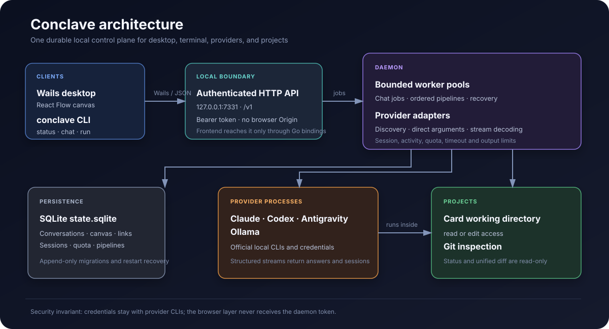
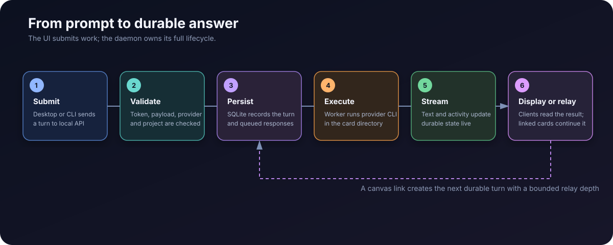

# Conclave

**English** | [Türkçe](README.tr.md)

Conclave is a local, daemon-first workspace for coordinating multiple AI coding providers and deterministic command pipelines. Its desktop client turns conversations, notes, projects, and provider hand-offs into a persistent infinite canvas, while the daemon keeps work running independently of the UI.



## Why Conclave?

AI coding CLIs are useful in isolation, but coordinating them usually means juggling terminals, repeating context, and losing running work when a client closes. Conclave provides one local control plane that:

- discovers installed Claude Code, Codex, Antigravity, Ollama, and Mnemo CLIs;
- opens solo or multi-provider conversations on a visual canvas;
- streams provider output and current activity into conversation cards;
- preserves provider sessions so later turns continue the same upstream conversation;
- assigns a project directory and `read` or `edit` access independently to each card;
- runs each card's providers on a model chosen per card, or on the CLI's own default;
- shows Git working-tree changes and unified diffs inside project cards;
- relays, discusses, or reviews completed answers through configurable canvas links;
- pairs two cards for a bounded conversation or an explicit work-until-done exchange;
- runs an optional command after each turn and feeds failures back to the same card;
- queues ordered build and test pipelines that survive client disconnection;
- persists conversations, canvas geometry, links, provider quota, sessions, and pipeline state in SQLite.

Conclave does not replace provider CLIs or their subscriptions. It runs the official local executables already installed and authenticated on the machine.

## How It Works

The daemon is the owner of runtime and persisted state. Both the terminal command and Wails desktop application are clients of the same versioned local API.

1. A client creates a conversation turn or pipeline through `127.0.0.1:7331`.
2. The API validates the bearer token and writes the job to SQLite.
3. A bounded daemon worker claims the queued job.
4. The provider adapter builds a direct argument array for the selected CLI. No intermediate shell evaluates it.
5. The daemon runs the command in the card's project or an isolated temporary directory.
6. Structured output is decoded, throttled, and persisted while the provider is still working.
7. Every client sees the same durable result; a linked card can receive the completed answer as its next turn.



Closing the desktop window does not stop the daemon. Interrupted queued or running work is recovered from SQLite when the daemon starts again.

## Desktop Canvas

The Wails desktop client uses React Flow as a persistent infinite board.

- Click an available provider to create a solo conversation card.
- Use **Group conversation** to send each turn to up to four available providers.
- Double-click empty canvas space to create a note.
- Drag and resize cards; geometry is stored by the daemon.
- Grow, shrink, or open a card fullscreen for long answers and documents.
- Read provider answers as GitHub Flavored Markdown; note cards can open local `.md` files and switch between editing and preview.
- Select a project directory per card, then toggle between `read` and `edit` access.
- Pick the model each of a card's providers runs on from that provider's own list, or type one it does not offer. Changing it starts a new provider session on the new model and carries the conversation over.
- Open the **Changes** tab to inspect Git status and a file's unified diff.
- Connect the right port of one conversation card to the left port of another to relay completed answers.
- Select exactly two conversation cards to pair them in both directions.
- Select a connection to choose `relay`, `dialogue`, or `review` mode, a round limit, or work-until-done dialogue.
- Use a card's **Test** tab to run a command after each turn. A failing exit code and its output become the card's next message, up to the configured retry limit.
- Press `Enter` to send a message and `Shift+Enter` to insert a newline.

A card without a project runs in a disposable scratch directory. In `read` mode the provider cannot modify the project. In `edit` mode Conclave uses the provider's non-interactive write-capable mode, so it may edit files and run commands without asking for confirmation.

### Card links

Connections turn the canvas into a workflow rather than a collection of independent chats.

| Mode | Behavior |
|---|---|
| `relay` | Sends the source answer to the target unchanged |
| `dialogue` | Presents the source as another participant and asks the target to answer it |
| `review` | Asks the target to critique the source output for errors, omissions, and risks |

Links use a bounded round budget by default. An explicit work-until-done dialogue ignores that budget and continues until every configured `until_pass` test cycle succeeds, a provider reports completion, a provider requests user input, or the user removes the link.

### Test feedback loop

For a project-backed card, the **Test** tab can configure a direct command such as `go test ./...`. Conclave runs it after a completed turn. Success ends the loop; failure output is posted back to the same conversation so the provider can fix the project and try again. The retry count is explicitly bounded, and the command is parsed into arguments without shell expansion.

## Supported Integrations

| Integration | Executable | Role | Streaming | Session resume |
|---|---|---|---|---|
| Claude Code | `claude` | Subscription CLI | Yes | Yes |
| OpenAI Codex | `codex` | Subscription CLI | Yes | Yes |
| Antigravity | `agy` | Subscription CLI | Yes | Yes |
| Ollama | `ollama` | Local models | Final output | No |
| Mnemo | `mnemo` | Shared memory discovery | Not applicable | Not applicable |

Set `CONCLAVE_OLLAMA_MODEL` to choose the default Ollama model. It defaults to `qwen3:4b`.

Mnemo is currently discovered and displayed, but semantic read/write integration is intentionally not enabled yet. Provider credentials are never copied into SQLite or Mnemo.

## Install

Windows 64-bit, one line in PowerShell:

```powershell
irm https://raw.githubusercontent.com/Emirfs/conclave/main/install.ps1 | iex
```

It downloads the latest release, verifies its SHA256 against the published `checksums.txt`, unpacks it into `%LOCALAPPDATA%\Programs\Conclave`, creates the **Conclave** and **Conclave - Kapat** shortcuts, and puts the `conclave` command on `PATH`.

To pin a version or install somewhere else, run the script with parameters instead of piping it:

```powershell
& ([scriptblock]::Create((irm https://raw.githubusercontent.com/Emirfs/conclave/main/install.ps1))) -Version v0.2.0
```

`-InstallDir`, `-NoShortcuts`, and `-NoPath` are also accepted.

Prefer a wizard? Each release also ships `conclave-windows-amd64-setup.exe`, a per-user installer that needs no administrator rights and carries the same two binaries.

## Updates

The daemon asks GitHub once a day whether a newer release exists. It only ever looks: nothing is downloaded or replaced without being asked for.

- When a release is available, a banner appears above the canvas with **Notları oku** and **Güncelle**.
- **Güncelle** hands the work to the `install.ps1` that sits next to the application, which waits for the app to exit, swaps the binaries, and starts the new build. A running program cannot replace its own files, which is why the update always closes the window.
- From a terminal, `conclave update` asks now instead of waiting for the daily check.
- A build made from source reports its version as `dev` and never checks at all.

## Requirements

Running an installed release needs nothing but Windows and the provider CLIs. The following are for building from source:

- Go `1.26.7` or newer
- Wails v2 CLI
- Bun
- At least one optional chat provider CLI: `claude`, `codex`, `agy`, or `ollama`
- `mnemo`, optional and currently discovery-only

Provider CLIs must already be installed, available on `PATH`, and authenticated using their own normal setup.

## Build

Build all Go packages:

```powershell
go build ./...
```

Build the frontend separately:

```powershell
Set-Location cmd/conclave-desktop/frontend
bun install
bun run build
```

Build the desktop executable:

```powershell
Set-Location cmd/conclave-desktop
wails build
```

## Run

Start the daemon:

```powershell
go run ./cmd/conclave daemon
```

Start the desktop client from another terminal:

```powershell
Set-Location cmd/conclave-desktop
wails dev
```

The packaged desktop client can start the daemon automatically when a `conclave` executable is next to it or available on `PATH`.

## Command-Line Usage

Check daemon health, discovered providers, and recent pipelines:

```powershell
go run ./cmd/conclave status
go run ./cmd/conclave status --json
```

Open a conversation and queue its first turn:

```powershell
go run ./cmd/conclave chat --provider claude "Review this repository"
```

Ask multiple providers in parallel:

```powershell
go run ./cmd/conclave chat `
  --provider claude `
  --provider openai `
  "Compare the current architecture"
```

Continue an existing Conclave conversation:

```powershell
go run ./cmd/conclave chat --conversation 12 "Which approach would you choose?"
```

Report the running build, and ask GitHub for a newer one:

```powershell
conclave version
conclave update
```

Queue an ordered pipeline. Stages stop at the first failure:

```powershell
go run ./cmd/conclave run --project . `
  --stage "build=go,build,./..." `
  --stage "test=go,test,./..."
```

Useful daemon options:

```text
--listen 127.0.0.1:7331   Local API address
--workers 2               Maximum concurrent pipelines
--chat-workers 4          Maximum concurrent provider jobs
--stage-timeout 20m       Timeout for each provider or pipeline command
--state-dir <path>        Override the state directory
```

## State and Recovery

On Windows, state is stored under `%LOCALAPPDATA%\conclave`. Other platforms use the operating system's user configuration directory.

| File | Purpose |
|---|---|
| `state.sqlite` | Conversations, messages, canvas, links, sessions, quota, and pipelines |
| `token` | Generated local API bearer token |
| `daemon.lock` | Prevents two daemons from owning the same state directory |

SQLite migrations are append-only and tracked with `PRAGMA user_version`. Jobs left in a transient state are made recoverable during startup.

## Security Model

- The API only accepts `127.0.0.1` or `localhost` listeners.
- Every request requires the generated bearer token.
- Requests carrying a browser `Origin` header are rejected.
- The React frontend never receives the token or calls HTTP directly; it invokes Go through Wails bindings.
- Commands are executed directly as argument arrays, without shell expansion.
- Sensitive environment variables containing token, secret, password, credential, or API-key names are removed from provider processes.
- Client-supplied paths used for Git inspection reject absolute paths and parent traversal.
- Provider credentials are not stored in SQLite, prompts, logs, or Mnemo.

`edit` access is intentionally powerful. Use `read` unless a card should be allowed to modify its selected project.

## Project Layout

| Path | Responsibility |
|---|---|
| `cmd/conclave/` | CLI entry point and daemon launcher |
| `cmd/conclave-desktop/` | Wails host and React/TypeScript canvas |
| `internal/api/` | Authenticated local HTTP API and Go client |
| `internal/daemon/` | Pipeline and provider worker lifecycle |
| `internal/domain/` | Shared transport and domain types |
| `internal/provider/` | CLI discovery, invocation, and stream decoding |
| `internal/statedir/` | State paths and token management |
| `internal/store/` | SQLite persistence, migrations, and recovery |
| `internal/update/` | Release check against GitHub; looks only, never installs |
| `internal/vcs/` | Read-only Git status and diff inspection |
| `internal/version/` | The running build's version, stamped in at link time |
| `install.ps1` | Installer and updater for released builds |

## Development

```powershell
go build ./...
go test ./...
```

Frontend production check:

```powershell
Set-Location cmd/conclave-desktop/frontend
bun run build
```

Conclave is currently an early local-first system. Its API version is `0.1.0`, and no stability guarantee is made for external API consumers yet.
