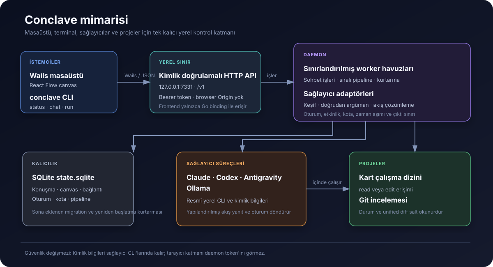
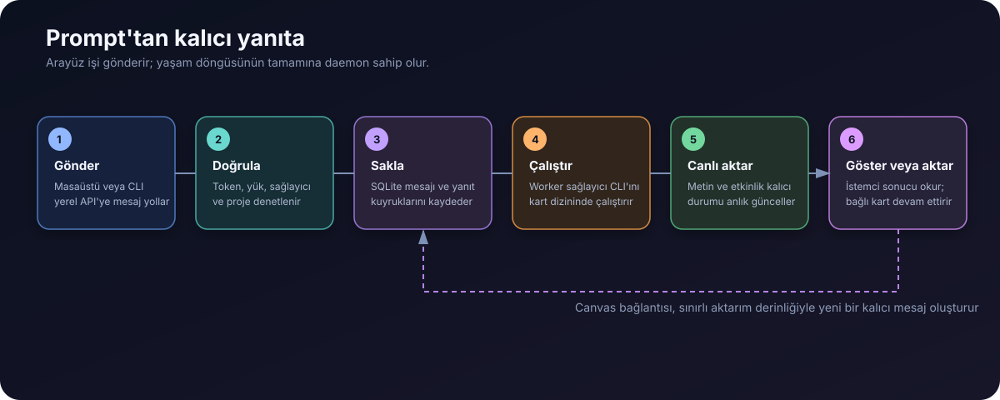

# Conclave

[English](README.md) | **Türkçe**

Conclave, birden fazla yapay zekâ kodlama sağlayıcısını ve belirlenebilir komut pipeline'larını koordine eden, yerel çalışan ve daemon merkezli bir çalışma alanıdır. Masaüstü istemcisi konuşmaları, notları, projeleri ve sağlayıcılar arası aktarımları kalıcı bir sonsuz canvas üzerinde birleştirir; daemon ise arayüz kapansa bile işleri yürütmeye devam eder.



## Conclave Ne İşe Yarar?

Yapay zekâ kodlama CLI'ları tek başlarına kullanışlıdır; ancak birkaçını birlikte yönetmek çok sayıda terminal, tekrarlanan bağlam ve istemci kapandığında kaybolan işler anlamına gelir. Conclave tek bir yerel kontrol katmanı sağlayarak şunları yapar:

- kurulu Claude Code, Codex, Antigravity, Ollama ve Mnemo CLI'larını keşfeder;
- görsel canvas üzerinde tek sağlayıcılı veya çok sağlayıcılı konuşmalar açar;
- sağlayıcı yanıtını ve anlık etkinliğini konuşma kartına canlı aktarır;
- sağlayıcı oturumunu saklayarak sonraki mesajı aynı uzak konuşmada sürdürür;
- her karta bağımsız proje dizini ve `read` veya `edit` erişimi atar;
- proje kartı içinde Git çalışma ağacı değişikliklerini ve unified diff'i gösterir;
- tamamlanan yanıtları yapılandırılabilir canvas bağlantılarıyla aktarır, tartıştırır veya inceletir;
- iki kartı sınırlı konuşma veya açıkça seçilen iş-bitene-kadar akışı için eşleştirir;
- her turdan sonra isteğe bağlı komut çalıştırıp hatayı aynı karta geri besler;
- istemci bağlantısından bağımsız, sıralı build ve test pipeline'ları çalıştırır;
- konuşmaları, canvas konumlarını, bağlantıları, kotaları, oturumları ve pipeline durumunu SQLite'ta saklar.

Conclave sağlayıcı CLI'larının veya aboneliklerinin yerine geçmez. Makinede kurulu ve kendi yöntemiyle kimlik doğrulaması yapılmış resmî yerel çalıştırılabilir dosyaları kullanır.

## Nasıl Çalışır?

Çalışma zamanı ile kalıcı durumun sahibi daemon'dur. Terminal komutları ve Wails masaüstü uygulaması aynı sürümlenmiş yerel API'nin istemcisidir.

1. İstemci `127.0.0.1:7331` üzerinden bir konuşma mesajı veya pipeline oluşturur.
2. API bearer token'ı doğrular ve işi SQLite kuyruğuna yazar.
3. Sınırlandırılmış daemon worker'ı sıradaki işi alır.
4. Sağlayıcı adaptörü seçilen CLI için doğrudan bir argüman dizisi üretir. Arada komutları yorumlayan bir shell bulunmaz.
5. Daemon komutu kartın projesinde veya yalıtılmış geçici dizinde çalıştırır.
6. Yapılandırılmış çıktı çözümlenir, yazma sıklığı sınırlandırılır ve sağlayıcı çalışırken SQLite'a kaydedilir.
7. Bütün istemciler aynı kalıcı sonucu görür; bağlı bir kart tamamlanan yanıtı yeni mesajı olarak alabilir.



Masaüstü penceresini kapatmak daemon'u durdurmaz. Yarım kalan kuyruk ve çalışma durumları daemon yeniden başladığında SQLite üzerinden kurtarılır.

## Masaüstü Canvas

Wails masaüstü istemcisi React Flow tabanlı kalıcı bir sonsuz pano sunar.

- Kullanılabilir bir sağlayıcıya tıklayarak tekil konuşma kartı oluşturun.
- **Grup konuşması** ile her mesajı aynı anda en fazla dört sağlayıcıya gönderin.
- Boş canvas alanına çift tıklayarak not oluşturun.
- Kartları taşıyıp boyutlandırın; geometri daemon tarafından saklanır.
- Uzun cevaplar ve belgeler için kartı büyütün, küçültün veya tam ekran açın.
- Sağlayıcı cevaplarını GitHub Flavored Markdown olarak okuyun; not kartlarında yerel `.md` dosyası açıp düzenleme ve önizleme arasında geçiş yapın.
- Her kart için proje dizini seçin, ardından `read` ile `edit` erişimi arasında geçiş yapın.
- **Değişiklikler** sekmesinden Git durumunu ve dosyanın unified diff'ini inceleyin.
- Tamamlanan yanıtları aktarmak için bir konuşma kartının sağ portunu diğerinin sol portuna bağlayın.
- Tam olarak iki konuşma kartını seçerek iki yönlü eşleştirin.
- Bir bağlantıyı seçerek `relay`, `dialogue` veya `review` modunu, tur sınırını ya da iş-bitene-kadar konuşmayı belirleyin.
- Her turdan sonra komut çalıştırmak için kartın **Test** sekmesini kullanın. Başarısız çıkış kodu ile komut çıktısı, ayarlanan yeniden deneme sınırına kadar kartın sonraki mesajı olur.
- Mesaj göndermek için `Enter`, yeni satır için `Shift+Enter` kullanın.

Projesi olmayan kart tek kullanımlık geçici dizinde çalışır. `read` modunda sağlayıcı projeyi değiştiremez. `edit` modunda Conclave sağlayıcının etkileşimsiz ve yazma yetkili modunu kullanır; bu nedenle sağlayıcı onay istemeden dosya değiştirebilir ve komut çalıştırabilir.

### Kart bağlantıları

Bağlantılar canvas'ı bağımsız sohbetler koleksiyonu olmaktan çıkarıp bir iş akışına dönüştürür.

| Mod | Davranış |
|---|---|
| `relay` | Kaynak yanıtı değiştirmeden hedefe gönderir |
| `dialogue` | Kaynağı başka bir katılımcı olarak sunar ve hedeften yanıt ister |
| `review` | Hedeften kaynak çıktıyı hata, eksik ve riskler açısından incelemesini ister |

Bağlantılar varsayılan olarak sınırlı tur bütçesi kullanır. Açıkça seçilen iş-bitene-kadar konuşma bu sınırı kaldırır; yapılandırılmış bütün `until_pass` test döngüleri geçince, sağlayıcı tamamlandığını bildirince, kullanıcı girdisi isteyince veya kullanıcı bağlantıyı kaldırınca durur.

### Test geri besleme döngüsü

Bir projeye bağlı kartın **Test** sekmesinde `go test ./...` gibi doğrudan bir komut yapılandırılabilir. Conclave komutu tamamlanan her turdan sonra çalıştırır. Başarı döngüyü bitirir; hata çıktısı aynı konuşmaya geri gönderilir ve sağlayıcıdan projeyi düzeltip yeniden denemesi istenir. Yeniden deneme sayısı açıkça sınırlandırılır ve komut shell genişletmesi olmadan argümanlara ayrılır.

## Desteklenen Entegrasyonlar

| Entegrasyon | Çalıştırılabilir dosya | Rol | Canlı akış | Oturum sürdürme |
|---|---|---|---|---|
| Claude Code | `claude` | Abonelik CLI'ı | Var | Var |
| OpenAI Codex | `codex` | Abonelik CLI'ı | Var | Var |
| Antigravity | `agy` | Abonelik CLI'ı | Var | Var |
| Ollama | `ollama` | Yerel modeller | Son çıktı | Yok |
| Mnemo | `mnemo` | Paylaşılan bellek keşfi | Uygulanamaz | Uygulanamaz |

Varsayılan Ollama modelini seçmek için `CONCLAVE_OLLAMA_MODEL` ortam değişkenini kullanın. Varsayılan model `qwen3:4b`'dir.

Mnemo şu anda keşfedilip arayüzde gösterilir; anlamsal okuma/yazma entegrasyonu bilinçli olarak henüz etkin değildir. Sağlayıcı kimlik bilgileri SQLite'a veya Mnemo'ya kopyalanmaz.

## Kurulum

64 bit Windows'ta, PowerShell'de tek satır:

```powershell
irm https://raw.githubusercontent.com/Emirfs/conclave/main/install.ps1 | iex
```

Betik en son yayını indirir, SHA256'sını yayındaki `checksums.txt` ile doğrular, `%LOCALAPPDATA%\Programs\Conclave` altına açar, **Conclave** ve **Conclave - Kapat** kısayollarını oluşturur ve `conclave` komutunu `PATH`'e ekler.

Belirli bir sürümü kurmak veya başka bir dizine kurmak için betiği boru yerine parametreyle çalıştırın:

```powershell
& ([scriptblock]::Create((irm https://raw.githubusercontent.com/Emirfs/conclave/main/install.ps1))) -Version v0.2.0
```

`-InstallDir`, `-NoShortcuts` ve `-NoPath` da kabul edilir.

Sihirbaz tercih ediyorsanız her yayında `conclave-windows-amd64-setup.exe` de var: yönetici hakkı istemeyen, aynı iki binary'yi taşıyan kullanıcı kapsamlı bir kurulum.

## Güncelleme

Daemon günde bir kez GitHub'a yeni bir yayın olup olmadığını sorar. Yalnızca bakar: istenmeden hiçbir şey indirilmez, hiçbir dosya değiştirilmez.

- Yeni sürüm varsa canvas'ın üstünde **Notları oku** ve **Güncelle** düğmeleriyle bir bant çıkar.
- **Güncelle**, uygulamanın yanındaki `install.ps1`'i çalıştırır; betik uygulamanın kapanmasını bekler, binary'leri değiştirir ve yeni yapıyı açar. Çalışan bir program kendi dosyalarını değiştiremez — güncellemenin pencereyi kapatmasının sebebi bu.
- Terminalden `conclave update`, günlük kontrolü beklemeden hemen sorar.
- Kaynaktan derlenen bir yapı sürümünü `dev` olarak bildirir ve hiç kontrol etmez.

## Gereksinimler

Kurulu bir yayını çalıştırmak için Windows ve sağlayıcı CLI'larından başka bir şey gerekmez. Aşağıdakiler kaynaktan derlemek içindir:

- Go `1.26.7` veya üzeri
- Wails v2 CLI
- Bun
- İsteğe bağlı sohbet CLI'larından en az biri: `claude`, `codex`, `agy` veya `ollama`
- İsteğe bağlı ve şimdilik yalnızca keşif için kullanılan `mnemo`

Sağlayıcı CLI'ları önceden kurulmuş, `PATH` üzerinde erişilebilir ve kendi standart yöntemleriyle yetkilendirilmiş olmalıdır.

## Derleme

Bütün Go paketlerini derleyin:

```powershell
go build ./...
```

Frontend'i ayrı olarak derleyin:

```powershell
Set-Location cmd/conclave-desktop/frontend
bun install
bun run build
```

Masaüstü çalıştırılabilir dosyasını üretin:

```powershell
Set-Location cmd/conclave-desktop
wails build
```

## Çalıştırma

Daemon'u başlatın:

```powershell
go run ./cmd/conclave daemon
```

Başka bir terminalde masaüstü istemcisini başlatın:

```powershell
Set-Location cmd/conclave-desktop
wails dev
```

Paketlenmiş masaüstü istemcisi, yanında veya `PATH` üzerinde bir `conclave` çalıştırılabilir dosyası bulursa daemon'u otomatik başlatabilir.

## Komut Satırı Kullanımı

Daemon sağlığını, keşfedilen sağlayıcıları ve son pipeline'ları görüntüleyin:

```powershell
go run ./cmd/conclave status
go run ./cmd/conclave status --json
```

Bir konuşma açıp ilk mesajı kuyruğa ekleyin:

```powershell
go run ./cmd/conclave chat --provider claude "Bu depoyu incele"
```

Aynı soruyu birden fazla sağlayıcıya paralel sorun:

```powershell
go run ./cmd/conclave chat `
  --provider claude `
  --provider openai `
  "Mevcut mimariyi karşılaştır"
```

Mevcut bir Conclave konuşmasını sürdürün:

```powershell
go run ./cmd/conclave chat --conversation 12 "Hangi yaklaşımı seçerdin?"
```

Çalışan yapıyı bildirin, GitHub'a yenisini sorun:

```powershell
conclave version
conclave update
```

Sıralı bir pipeline kuyruğa ekleyin. İlk hata sonraki aşamaları durdurur:

```powershell
go run ./cmd/conclave run --project . `
  --stage "build=go,build,./..." `
  --stage "test=go,test,./..."
```

Yararlı daemon seçenekleri:

```text
--listen 127.0.0.1:7331   Yerel API adresi
--workers 2               En fazla eşzamanlı pipeline sayısı
--chat-workers 4          En fazla eşzamanlı sağlayıcı işi sayısı
--stage-timeout 20m       Her sağlayıcı veya pipeline komutunun zaman aşımı
--state-dir <yol>         Durum dizinini değiştirir
```

## Durum ve Kurtarma

Windows'ta durum `%LOCALAPPDATA%\conclave` altında tutulur. Diğer platformlarda işletim sisteminin kullanıcı yapılandırma dizini kullanılır.

| Dosya | Amaç |
|---|---|
| `state.sqlite` | Konuşmalar, mesajlar, canvas, bağlantılar, oturumlar, kotalar ve pipeline'lar |
| `token` | Üretilen yerel API bearer token'ı |
| `daemon.lock` | İki daemon'un aynı durum dizinine sahip olmasını engeller |

SQLite migration'ları yalnızca sona eklenir ve `PRAGMA user_version` ile izlenir. Geçici durumda kalan işler başlangıçta yeniden çalıştırılabilir duruma getirilir.

## Güvenlik Modeli

- API yalnızca `127.0.0.1` veya `localhost` dinleme adresini kabul eder.
- Her istek üretilen bearer token'ı taşımak zorundadır.
- Tarayıcı `Origin` başlığı taşıyan istekler reddedilir.
- React frontend token'ı görmez ve doğrudan HTTP çağrısı yapmaz; Go tarafını Wails binding'leri üzerinden çağırır.
- Komutlar shell genişletmesi olmadan doğrudan argüman dizileri olarak çalıştırılır.
- Adında token, secret, password, credential veya API key bulunan hassas ortam değişkenleri sağlayıcı süreçlerinden çıkarılır.
- Git incelemesinde istemciden gelen yollar mutlak yol ve üst dizine geçiş denetiminden geçirilir.
- Sağlayıcı kimlik bilgileri SQLite, prompt, log veya Mnemo içinde saklanmaz.

`edit` erişimi bilinçli olarak güçlüdür. Bir kart seçili projeyi değiştirmemeliyse `read` kullanın.

## Proje Yapısı

| Yol | Sorumluluk |
|---|---|
| `cmd/conclave/` | CLI giriş noktası ve daemon başlatıcısı |
| `cmd/conclave-desktop/` | Wails host'u ve React/TypeScript canvas |
| `internal/api/` | Kimlik doğrulamalı yerel HTTP API ve Go istemcisi |
| `internal/daemon/` | Pipeline ve sağlayıcı worker yaşam döngüsü |
| `internal/domain/` | Paylaşılan aktarım ve domain tipleri |
| `internal/provider/` | CLI keşfi, çağırma ve akış çözümleme |
| `internal/statedir/` | Durum yolları ve token yönetimi |
| `internal/store/` | SQLite kalıcılığı, migration'lar ve kurtarma |
| `internal/update/` | GitHub'daki yayın kontrolü; yalnızca bakar, kurmaz |
| `internal/vcs/` | Salt okunur Git durum ve diff incelemesi |
| `internal/version/` | Çalışan yapının sürümü, bağlama anında gömülür |
| `install.ps1` | Yayınlanan yapılar için kurulum ve güncelleme betiği |

## Geliştirme

```powershell
go build ./...
go test ./...
```

Frontend production kontrolü:

```powershell
Set-Location cmd/conclave-desktop/frontend
bun run build
```

Conclave şu anda erken aşamada, local-first bir sistemdir. API sürümü `0.1.0`'dır ve haricî API tüketicileri için henüz kararlılık garantisi verilmez.
